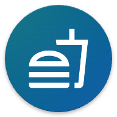

    
    <h2 style="font-size: 48px; font-weight: bold; margin-left: 20px; font-family: avenir; font-style: italic; font-weight: 300;">
        KMMeal
    </h2>

# About

A simple meal app developed with KMM. Nothing more nothing less...

## _App Features_

- Like to save meals
- Search meals by 3 filters:
  - Category
  - Area
  - Ingredient
- Fetch a random meal
- See ingredients and meal instructions
- Utilize [**TheMealDB**](https://www.themealdb.com/)

## _Tech Features_

- **Kotlin Multiplatform Mobile**
- **Jetpack Compose**
- **SwiftUI**
- **Clean Architecture**
- **MVI-like Pattern** that utilizes State Machine logic
- **Koin** for dependency injection
- **Ktor** for networking
- **Realm** for data persistence
- **Kotlinx Serialization** for serialization
- **Coil** for Image loading and caching in Jetpack Compose
- **Nuke** for Image loading and caching in SwiftUI
- **Material3** for Android
- **Human Interface** for iOS
- **Dark and Light interfaces**
- Android 12 **Splash API**
- [**KMM-ViewModel**](https://github.com/rickclephas/KMM-ViewModel) and [**KMP-NativeCoroutines**](https://github.com/rickclephas/KMP-NativeCoroutines)

For more information, see: [libs.versions.toml](./gradle/libs.versions.toml)

## _Some Disclaimer_

This is my first KMM project and what I wanted to achieve was to understand how KMM can be used to create cross platform mobile applications and its internal functionality along with fresh libraries such as Material3, Ktor, Koin or Realm etc.

There are still many things that can be add to this project such as:
- Baseline Profiles
- Multi Modularization
- Code quality libraries such as Ktlint
- Unit Testing and so on...

However, the aim of the project is to learn KMM and some related libraries to start from somewhere, and I believe I have achieved it. Since I have started that app without any plan, and every future has evolved during the development, it become a frustrating process in the end. However, it is worth to share what I have achieved during this process. So here it is, KMMeal.

Furthermore, since I have understood the base concepts of KMM development along with the libraries, I will try to utilize the things undone on another projects. I will also publish the know-how I have gained on Medium soon.

## Want Showcase? Here They Are!

|       |                       Android                       |                     iOS                     |
|:------|:---------------------------------------------------:|:-------------------------------------------:|
| Light |  |  |
| Dark  |    |    |